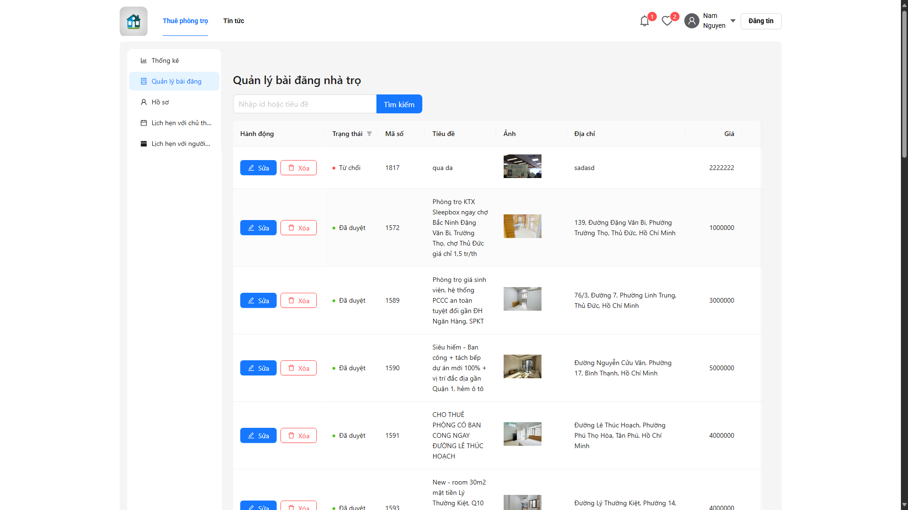

# Rental House Management System

## Giới thiệu
Hệ thống quản lý nhà trọ là một ứng dụng web được xây dựng để giúp chủ nhà trọ và người thuê nhà quản lý việc cho thuê nhà trọ một cách hiệu quả. Hệ thống cung cấp các tính năng như đăng ký, đăng nhập, quản lý thông tin nhà trọ, đặt lịch xem nhà, và thống kê.

## Công nghệ sử dụng
### Frontend
- React.js với TypeScript
- Ant Design cho giao diện người dùng
- React Query cho quản lý state và caching
- React Router cho điều hướng
- Redux Toolkit cho quản lý state toàn cục

### Backend
- ASP.NET Core Web API
- Entity Framework Core
- SQL Server
- JWT Authentication

## Các tính năng chính
1. **Quản lý người dùng**
   - Đăng ký/Đăng nhập
   - Phân quyền người dùng (Admin, User)
   - Quản lý thông tin cá nhân

2. **Quản lý nhà trọ**
   - Đăng tin cho thuê nhà
   - Tìm kiếm và lọc nhà trọ
   - Xem chi tiết nhà trọ
   - Quản lý trạng thái nhà trọ

3. **Quản lý lịch hẹn**
   - Đặt lịch xem nhà
   - Quản lý trạng thái lịch hẹn

4. **Thống kê và báo cáo**
   - Thống kê nhà trọ theo trạng thái
   - Thống kê lịch hẹn

## Giao diện và hình ảnh

### Trang chủ và Tìm kiếm

### Chi tiết nhà trọ

### Quản lý bài đăng và tài khoản

### Đăng ký và Đăng nhập

### Lịch hẹn và Báo cáo

### Danh sách nhà trọ đã lưu

### Logo

